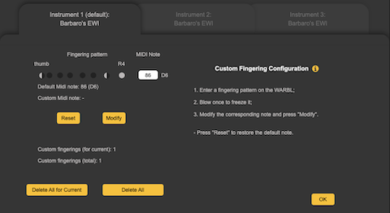
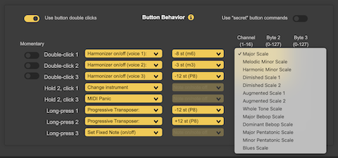
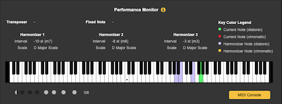
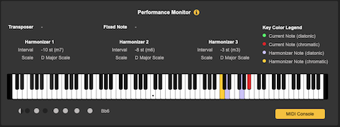
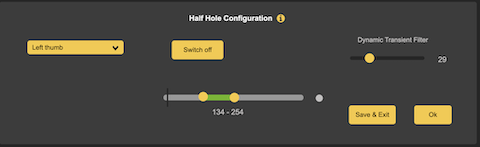

## WARBL is a USB MIDI wind controller.

Please see the web site for more info:

https://warbl.xyz


## This is a Custom Build for WARLB!

The code for this firmware was heavily modified and it has not been fully tested yet! You are welcome to try it and give some feedback.

### If you flash this firmware onto your WARBL, all your custom settings will be erased.

Also, your WARBL will not work with the official Configuration tools (Web page and apps) anymore. You will have to use the [Configuration page](https://barbaro.it/web/static/warbl/configure.html) contained in this repository (which works with with the original firmware also).

#### This software is provided “as is," and you use the software at your own risk. I make no warranties as to performance, merchantability, fitness for a particular purpose, or any other warranties whether expressed or implied.


## New Features

## Custom Fingering


The original "Custom Fingering" tool has been replaced by a new tool that allows you to memorize up to 30 override fingerings, each pertinent to the currently selected fingering schema.
To add a new override, while the WARBL is connected to the Configuration Tool:
- Open the "Custom Fingering" section
- Enter a fingering pattern on the WARBL
- Blow once to freeze it
- Modify the corresponding note and press "Modify".

- Press "Reset" to restore the default note.
- Enter "0" to silent a position.

## 3-voice Diatonic/Chromatic Harmonizer


You can add an "harmonizing" action to the buttons. You can then select the interval (at which the additional voice will be played) and a reference scale.

If you activate the harmonizer while playing a note, it will take that note as tonic and it will dinamically adjust the interval to keep it "diatonic" to the selected scale.

If you activate the harmonizer without playing a note, the harmonizer will keep the selected interval unaltered.


## General Transposer

There are two type of Tranposer actions for the buttons: normal and "progressive".

If you select the "normal" transposer, then you can select an interval: all your notes will be transposed by that interval. The button will act as an on/off switch.

If you select the progressive transposer then, every time you activate it with a button, the interval will be added (or subtracted) to the current transposition (much like the original octave and semitone up/down action).


## Fixed Note

When you activate it while playing a note, that note will be kept active.

It is not a drone: the fixed note will switch on/off along with the main note.


## Performance Monitor



This new section in the Configuration tool will show you some real time information.

- The current note you are playing
- The current fingering on WARBL
- The current state of Transposer, Fixed note and Harmonizer
- Eventual harmonizer-generated notes.
- When the diatonic harmonizer is selected, it will color code the notes on the piano keyboard to indicate whether they are diatonic or chromatic in the current context. This could be useful for learning purposes also!


## Half-hole Detection

Experimentally, I have activated an half-hole detection function.

This function is active on three holes only: thumb, R4 and R3.

- Half hole on R4 and R3 will raise the corresponding pitches (C and D), by one semitone in Barbaro's EWI fingering schema.
- For other fingering schemas, you will have to add a custom fingering of your choice to be coupled with R3/R4 half holes.
- Half thumb hole will raise all pitches by one octave, effectively adding a third register to the instrument.

### Half-hole Calibration
Half hole detection auto-calibrates continously based on auto-calibration of the sensors and the current ambient light conditions.

In the "Calibration" section of the Configuration tools there is a new "Half Hole Config" button that shows the following section:



Basically, you can  de-activate the half-hole detection for the selected tone hole.

You can also observe the exact interval for each hole to be detected as half-open, while a real-time vertical bar shows you where the current value is.

There is a configurable small delay in finger detection to make it more accurate. You can change its duration with the "Dynamic Transient Filter" control. This delay is applied only when a few gestures are detected:
- Left thumb is moving
- The interval between notes is an octave or more
- 4 or more fingers are changing positions
This additional dynamic filter should avoid twiches and glitches and is added to the normal Transient filter.


## New Fingering: Barbaro's EWI

I have added a new fingering pattern of my own invention that allows for a two and a half octaves full chromatic range.

You can download [the chart here](readme_files/Barbaro_s_EWI_Fingering%20Chart.pdf).


---

# Original README:

For updating the software, typical users would just install the .hex file using the installer that you can [download here](https://warbl.xyz/documentation.html).
 
Advanced users can use the Arduino IDE to modify and upload the code. WARBL uses some special settings for USB MIDI that make the initial IDE setup more complicated than with a normal Arduino. However, you only have to follow most of the steps once.

### How to use WARBL with the Arduino IDE:

#### Install Arduino IDE

* Install / run the latest version of the Arduino IDE. [You can download the latest version of the Arduino IDE here](https://www.arduino.cc/en/Main/Software).

* In Linux, the Arduino IDE requires that you be part of the `dialout` group to successfully detect and write to hardware (see [here](https://support.arduino.cc/hc/en-us/articles/4401874331410#ser_open-permission-denied)). If running `id` in a terminal does not list `dialout` as one of the groups your user belongs to, [run `sudo usermod -a -G dialout $USER`](https://support.arduino.cc/hc/en-us/articles/360016495679-Fix-port-access-on-Linux), then log out and back in. Running `id` should now include the `dialout` group.

#### General considerations

* If you plan to do editing, please note that we are using 4-space indentation with a specific formatting style. To use this style in the Arduino editor, go to the Arduino preferences, and at the bottom where it says `More preferences can be edited directly in the file`, open and edit the preferences.txt file mentioned there, and add or change the `editor.tabs.size=4` line as shown. Also, copy the file **formatter.conf** from this repository to the same directory that the preferences.txt is, this will let you use the Auto Format feature in the Arduino Tools menu to properly format the code. ToDO: add .clang-format file for IDE 2.0
* On MacOS version of Arduino IDE you have to edit a JSON file located at `/Users/(username)/.arduinoIDE/settings.json `   
 For the 4-space indentation, it should be enough to add the following key-value pair:

  `"editor.tabSize": 4`

#### Editing the Warbl firmware

* Next you can open the 'warbl_firmware' project from the Arduino IDE

* WARBL runs on 3.3V and at 8Mhz, which is nonstandard for Arduino boards with the same processor. I used the Adafruit ItsyBitsy 32u4-3.3V for prototyping WARBL, so the easiest way to set up the IDE is to install the Adafruit boards package, [following the instructions here](https://learn.adafruit.com/introducting-itsy-bitsy-32u4?view=all#arduino-ide-setup). **Windows 7 only:** You will also have to install the drivers, following the link partway down the above page.

* Now, we need to change some USB settings, so we first edit the boards.txt file, which typically is found here:
   
   * Windows: `C:\Users\(username)\AppData\Local\Arduino15\packages\adafruit\hardware\avr\1.4.12` 
   
   * Linux: `/home/(username)/.arduino15/packages/adafruit/hardware/avr/1.4.15`

   * Mac: `/Users/(username)/Library/Arduino15/packages/adafruit/hardware/avr/1.4.15`


    I use the free NotePad++ app to edit this. First, change the VID and PID to the WARBL USB VID and PID:

       `itsybitsy32u4_3V.build.vid=0x04D8`
  
       `itsybitsy32u4_3V.build.pid=0xEE87`
  
    Next, make the same changes to these lines:
  
       `itsybitsy32u4_3V.vid.0=0x04D8`
  
       `itsybitsy32u4_3V.pid.0=0xEE87`
 
    Then change the product name:
  
       `itsybitsy32u4_3V.build.usb_product="WARBL"`
  
    And finally the manufacturer:
  
       `itsybitsy32u4_3V.build.usb_manufacturer="Mowry Stringed Instruments"`


*	It is also necessary to configure the USBCore to request only 20mA of power. Otherwise iOS devices will say that the device uses too much power, even though it doesn’t. It only matters how much it requests. 
    So, find this file:
  
    * Windows: `C:\Program Files (x86)\Arduino\hardware\arduino\avr\cores\arduino\USBCore.h`
    * Linux: `/home/(username)/.arduino15/packages/arduino/hardware/avr/1.8.6/cores/arduino/USBCore.h`
    * Mac: `/Users/(username)/Library/Arduino15/packages/arduino/hardware/avr/1.8.6/cores/arduino/USBCore.h`
  
    > **Please note:** You may want to make a backup copy of this file before changing it. Changing it will affect all USB boards that you program with the IDE. The setting that we’re changing probably won’t make a difference in most cases, but it’s important to know this. 

    Find this line and change the power consumption request to 20: 
     
        `USB_CONFIG_POWER_MA(20)` 


*	Next, in Arduino IDE, you’ll need to install three libraries that aren’t installed by default. They are:
 
    `TimerOne`, `DIO2`, and `MIDIUSB`
 
    To install them, go to Sketch > Include Library > Manage Libraries, then search for the name of each, one at a time. Then it will give you an option to install each one.


*	Now open the WARBL sketch that you saved to in your sketchbook folder. Four tabs should open. 
 
 
 
*	Next, tell it which board you have by going Tools > Board and select `Adafruit ItsyBitsy 32u4 3V 8MHz`.


*	Then turn on “show verbose output during upload” under File > Preferences. Now, if all went well, you should be able to click the upload button. It will compile first. 


*	Then, when it tries to upload, you should see this output repeating in the messages at the bottom of the screen:

    ```
    PORTS {} / {} => {}   
    PORTS {} / {} => {}    
    PORTS {} / {} => {}    
    PORTS {} / {} => {}    
    PORTS {} / {} => {}
    ```


*	Now, use a toothpick to double-click the WARBL reset button. The LED should pulse and the code should upload. If the LED doesn’t light or stays solid instead if pulsing, try again. If the IDE stops trying to upload, click “Upload” again, and try double-clicking again. It can take a few tries to get the timing right.


### A few additional notes:
The serial CDC class on WARBL needs to be turned off to make it a USB MIDI class-compliant device. This also means that you won't be able to use the serial monitor in Arduino IDE, and you'll have to double-click the programming button to install firmware. To turn serial off on the newest version of the Arduino IDE, you can uncomment the following line in the `USBDesc.h` file:
 
 `#define CDC_DISABLED`
 
 The above file should be located here: 
   
   * Windows: `C:\Program Files (x86)\Arduino\hardware\arduino\avr\cores\arduino`
   * Linux: `/home/(username)/.arduino15/packages/arduino/hardware/avr/1.8.6/cores/arduino/`

Note: turning off the CDC class will turn it off for any Arduino that you program with the IDE, so you'll need to remember to turn it back on after programming the WARBL. You can leave the `USBDesc.h` file open and comment/uncomment the line and save it as necessary without having to close/reopen the IDE. I keep a shortcut to `USBDesc.h` on my desktop for this purpose.

Turning off the CDC class will also make it so that Windows 7 won't require drivers to be installed for WARBL to work in normal MIDI mode.

Have fun!
